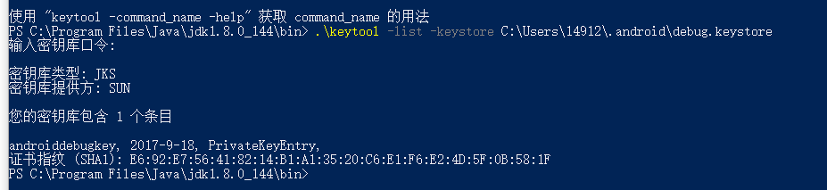

### Android SHA1
最近在集成谷歌地图，大家都知道像这种三方的东西都需要我们提供一个安全码，来生成私钥和公钥。
##### 什么是sha1:
> sha1其实就是一个安全码
##### 它在android中有什么用
> 用来集成三方，比如登陆支付等

##### 如何获取sha1
> 计算机中有两种sha1，一种是默认的，一种是如果我们自己创建的app，自己生成签名文件，也就是所谓的jks，然后获取sha1

1.获取默认的sha1

> 我在集成谷歌地图的时候因为是在自己的一个test project中，也就懒得自己为项目生成一个jks，使用的是默认的sha1：

主要是用的是 keytool命令，如果这个命令配置到了系统变量中，那么可以在任意地方打开cmd，然后输入如下命令
	
	keytool -list -keystore + jks 文件路径
	//一般默认的jks路径是C:\Users\14912\.android 这个文件夹里面有一个debug.keystore，就是它

但是如果这个命令没有配置到系统变量中，那么需要到你的jdk文件夹里C:\Program Files\Java\jdk1.8.0_144\bin 打开cmd输入这个命令，有时候还是不行的话要./keytool -list -keystore + jks路径

口令默认是android

2.如果是公司里的项目我们可能会自己创建一个keystore，然后在build里面配置

		 signingConfigs {
	         shengquan {
	          storeFile file("shengquan.jks")
              storePassword "shengquan"
              keyAlias "shengquan"
	          keyPassword "shengquan"
	        }
	    }

然后像生成默认sha1 的方法一样，区别是这个时候不再用默认的keystore而是用的是自己创建的keystore

> 自己创建的keystore也可用于打包签名，美滋滋

然后就可以美滋滋的用sha1对接第三方了